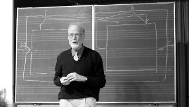
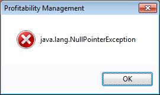

# Everyday Programming

## Partiality (a.k.a, the billion-dollar mistake)



## Partiality (a.k.a, the billion-dollar mistake)



## Partiality (a.k.a, the billion-dollar mistake)

$$\texttt{<!-- Code Example -->}$$

$$\texttt{<!-- Inspect and run scala/OrdinaryPartiality.scala -->}$$

## Referential Transparency (a.k.a., the substitution property)

**Substitution Property:** Let $x$ and $y$ be expressions. If $x = y$, then in any expression in which $x$ appears as a subexpression, the subexpression $x$ may be replaced with $y$ without changing the meaning of the outer expression.

\begin{align*}
&\text{If }   &                  x &= y \\
&\text{then } & 4x^2 - \frac{1}{x} &= 4y^2 - \frac{1}{y} \\
&             &                    &= 4x^2 - \frac{1}{y} \\
&             &                    &= 4y^2 - \frac{1}{x}
\end{align*}

## Referential Transparency (a.k.a., the substitution property)

$$\texttt{<!-- Code Example -->}$$

$$\texttt{<!-- Inspect and run scala/OrdinaryIO.scala -->}$$

# Lambda Calculus

## Lambda Calculus - Lambda Expressions

**Classic mathematics:**

$$ f(x) = x^2 $$

**Lambda expression:**

$$ \lambda x . x^2 $$
$$ x \mapsto x^2 $$
$$ f = x \mapsto x^2 $$

**Haskell:** `\x -> x**2`

**Javascript:** `x => x**2`

**Java:** `(x: double) -> Math.pow(x, 2.0)`

## Lambda Calculus - Types

**Typed expressions:**

$$ f : \begin{cases} \mathbb{R} \to \mathbb{R} \\ x \mapsto x^2 \end{cases} $$

**Haskell:**

```haskell
f :: Double -> Double
f x = x**2
-- equiv. f = \x -> x**2
```

**Java:**

```java
double f(double x) { return Math.pow(x, 2.0); }
// or
Function<Double, Double> f = (double x) -> Math.pow(x, 2.0);
// however, in Java their meaning is different
```

## Lambda Calculus - Polymorphism

**Polymorphic Expressions:**

$$ \cup =
\begin{cases}
  \forall T; \mathcal{P}(T) \times \mathcal{P}(T) \to \mathcal{P}(T) \\
  (A, B) \mapsto \left\{ t \in T \mid\vert t \in A \text{ or } t \in B \right\}
\end{cases}
$$

**Haskell:**

```haskell
union :: Set t -> Set t -> Set t
union a b = Set.fromList (Set.toList a ++ Set.toList b)
```

**Java:**

```java
<T> Set<T> union(Set<T> a, Set<T> b) {
  SortedSet<T> u = new SortedSet<T>();
  for (T t : a) { u.add(t); }
  for (T t : b) { u.add(t); }
  return u;
}
```

# Category Theory

## Category Theory - Category

**Category:** A _category_ $\mathcal{C}$ consists of:

  * objects: $A \in \mathcal{C}$, $B \in \mathcal{C}$, ...,
  * morphisms: $f: A \to B$, $g: B \to C$, ..., and
  * a composition rule: $g \circ f : A \to C$,

such that:

  1. composition is associative (e.g. $h \circ (g \circ f) = (h \circ g) \circ f$), and
  2. every object $A$ has an identity morphism $id_A$.

**Examples:**

  * $\mathbf{Grp}$, the category of groups and group homomorphisms.
  * $\mathbf{Top}$, the category of topological spaces and continuous functions.
  * $\mathbf{Set}$, the category of all sets and all functions.
  * The Polymorphic Typed Lambda Calculus.

## Category Theory - Functor

**Functor:** Let $\mathcal{C}$ and $\mathcal{D}$ be categories. A _functor_ $F: \mathcal{C} \to \mathcal{D}$ is a mapping between categories:

  * objects of $\mathcal{C}$ are mapped to objects of $\mathcal{D}$, and
  * morphisms of $\mathcal{C}$ are mapped to morphisms of $\mathcal{D}$,

such that:

  1. for all $A \in \mathcal{C}$, $F(id_A) = id_{F(A)}$,
  2. if $f: A \to B$ is a morphism in $\mathcal{C}$, then $F(f): F(A) \to F(B)$, and
  3. $F$ is compatible composition (e.g. $F(g \circ f) = F(g) \circ F(f)$).

**Examples:**

  * $\xymatrix{\mathbf{Grp} \ar[r]^{U(\cdot)} & \mathbf{Set}}$
  (groups _are_ sets, homomorphisms _are_ functions)

  * $\xymatrix{\mathbf{Set} \ar[r]^{\mathcal{F}\langle\cdot\rangle} & \mathbf{Grp}}$
  (free group construction)

  * $\xymatrix{\mathbf{Set} \ar[r]^{\mathcal{P}(\cdot)} & \mathbf{Set}}$
  (power set construction)

## Category Theory - Adjoint Functors

**Adjoint Functors:** Let $L: \mathcal{C} \to \mathcal{D}$ and $R: \mathcal{D} \to \mathcal{C}$ be functors. If for all $X \in \mathcal{C}$ and for all $Y \in \mathcal{D}$ there exists a bijection

$$
\mathcal{D}(L(X), Y) \cong \mathcal{C}(X, R(Y))
$$

(natural in $X$ and $Y$), then $L$ is said to be left adjoint to $R$, and $R$ is said to be right adjoint to $L$.

\vfill

**Example:** Let:

  * $\mathcal{F}\langle\cdot\rangle: \mathbf{Set} \to \mathbf{Grp}$ (free group construction),
  * $U: \mathbf{Grp} \to \mathbf{Set}$ (forgetful functor).

$\mathcal{F}\langle\cdot\rangle$ is left adjoint to $U$, meaning $\mathbf{Grp}(\mathcal{F}\langle X\rangle, G) \cong \mathbf{Set}(X, U(G))$

# Semantics of Programs

## Semantics of Programs - Denotational Semantics

](eugenio_moggi.jpg)

## Semantics of Programs - Denotational Semantics

**Operational Semantics:** The meaning of a program is defined by the final result of the program. Ignores side effects.

\vfill

**Denotational Semantics:** The meaning of a program is defined by embedding into an intended mathematical model. Considers side effects relative to their embedding into the intended model.

\vfill

**Logical Semantics:** The meaning of a program must be invariant of the models that interpret the program.

## Semantics of Programs - Monads

**Monad:** Let $L: \mathcal{C} \to \mathcal{D}$ be left adjoint to $R: \mathcal{D} \to \mathcal{C}$. A _monad_ $M$ on $\mathcal{C}$ is the composition $M = R \circ L$.

\vfill

**Equivalently:** The triple $(M, \mathrm{unit}, \mathrm{bind})$ is a _monad_ on $\mathcal{C}$, where

  * $\mathrm{unit}: \forall A \in \mathcal{C}; A \to M(A)$, and
  * $\mathrm{bind}: \forall A, B \in \mathcal{C}; \mathcal{C}(A, M(B)) \to \mathcal{C}(M(A), M(B))$,

satisfying technical conditions guaranteeing that $\mathcal{C}$ forms a new category with morphisms $A \to M(B)$, called the _Kleisli category_ of $M$.

## Semantics of Programs - Monads for Program Semantics

**Moggi's Approach:**

  1. Consider a base category of types and programs (e.g. the Polymorphic Typed Lambda Calculus).
  2. Identify formal logics we'd like new programming languages to satisfy (e.g. extensions of the Polymorphic Typed Lambda Calculus)
  3. Find monads on the base category that can interpret the desired extension logics.
  4. Prove theorems about our new programming language by considering its interpretation in resulting Kleisli category.

## Semantics of Programs - Monads for Program Semantics

Some monads (i.e. language extensions) Moggi considers:

  * _partiality_. $M(A) = 1 \sqcup A$.
  * _nondeterminism_. $M(A) = \mathcal{P}_\mathrm{finite}(A)$.
  * _side-effects_. $M(A) = \mathcal{C}(S, A \times S)$ where $S$ is the set of states.
  * _exceptions_. $M(A) = E \sqcup A$ where $E$ is the set of exceptions.
  * _continuations_. $M(A) = \mathcal{C}(\mathcal{C}(A, R), R)$ where $R$ is the set of results.

# Monads in Everyday Programming

## Monadic Partiality

$$\texttt{<!-- Code Example -->}$$

$$\texttt{<!-- Inspect and run scala/MonadicPartiality.scala -->}$$

$$\texttt{<!-- Inspect scala/LibMaybe.scala -->}$$

## Referentially-transparent Monadic I/O

$$\texttt{<!-- Code Example -->}$$

$$\texttt{<!-- Inspect and run scala/MonadicIO.scala -->}$$

$$\texttt{<!-- Inspect scala/LibIO.scala -->}$$

# Further Examples

## Further Examples - Monad Menagerie

**Monad Menagerie:**

  * _Non-deterministic computations:_
  $M(A) = \mathtt{List}(A)$
  (finite lists with entries in $A$)

  * _Exception handling:_
  $M(A) = \mathtt{Err} \coprod A$

  * _Computations with access to a read-only state variable:_
  $M(A) = \mathcal{C}(\mathtt{Env}, A)$

  * _Computations with access to an append-only state variable:_
  $M(A) = A \times \mathtt{Log}$
  
  * _Computations with full access to a state variable:_
  $M(A) = \mathcal{C}(\mathtt{State}, A \times \mathtt{State})$

  * ...and more

## Further Examples - Non-deterministic computations

```haskell
type List A = ... -- finite lists of members of A

-- List is a monad

unit :: A -> List A
unit a = singleton a

bind :: (A -> List B) -> List A -> List B
-- for each `a` in `as`, form the list `f a`,
-- then concat all the results
bind f as = concatMap (\a -> f a) as
```

## Further Examples - Non-deterministic computations

```haskell
roll n :: Int -> List Int
roll n = [1..n]

rollPhysicalDamage :: List Int
rollPhysicalDamage = do x <- roll 4
                        y <- roll 4
                        return x + y

rollMagicDamage :: List Int
rollMagicDamage = roll 6

magicSword :: List Int
magicSword = do physical <- rollPhysicalDamage
                magic <- rollMagicDamage
                return physical + magic
```

## Further Examples - Exception Handling

```haskell
type Err = ...
type Try A = Left Err | Right A

-- Try is a monad

unit :: A -> Try A
unit a = Right a

bind :: (A -> Try B) -> Try A -> Try B
bind f (Left err) = Left err
bind f (Right a) = f a
```

## Further Examples - Exception Handling

```haskell
type Err = ...
type Try A = Left Err | Right A

-- Try actions

fail :: Err -> Try A
fail err = Left err

catch :: (Err -> Try A) -> Try A -> Try A
catch f (Right a) = Right a
catch f (Left err) = f err
```

## Further Examples - Read-only State

```haskell
type Env = ...
type Reader A = Env -> A

-- Reader is a monad

unit :: A -> Env -> A
unit a env = a

bind :: (A -> Env -> B) -> (Env -> A) -> Env -> B
bind g f env = g (f env) env

-- Reader actions

read :: Reader Env
read env = env
```

## Further Examples - Append-only State

```haskell
type Log = List String
type Writer A = (A, Log)

-- Writer is a monad

unit :: A -> (A, Log)
unit a = (a, empty)

bind :: (A -> (B, Log)) -> (A, Log) -> (B, Log)
bind f (a, log) = let (b, log') = f a in (b, concat log log')

-- Writer actions

write :: Log -> Writer ()
write log = ((), log)
```

## Further Examples - Append-only State

```haskell
qux :: Foo -> Bar
qux foo = ...

withLogging :: (A -> Log) -> (B -> Log)
            -> (A -> B) -> A -> Writer B
withLogging logA logB f a = do write (logA a)
                               let b = f a
                               write (logB b)
                               return b

quxWithLogging :: Foo -> Writer Bar
quxWithLogging =
  withLogging (\foo -> empty)
              (\bar -> singleton ("output: " ++ show bar))
              qux
```

## Further Examples - Full-access State

```haskell
type Model = ...
type State A = Model -> (A, Model)

-- State is a monad

unit :: A -> State A
-- unit :: A -> Model -> (A, Model)
unit a mod = (a, mod)

bind :: (A -> State B) -> (State A -> State B)
-- bind :: (A -> Model -> (B, Model))
--      -> (Model -> (A, Model))
--      -> Model -> (B, Model)
bind g f mod = let (a, mod') = f mod in g a mod'
```

## Further Examples - Full-access State

```haskell
type Model = ...
type State A = Model -> (A, Model)

-- State actions

get :: State Model
-- get :: Model -> (Model, Model)
get model = (model, model)

put :: Model -> State ()
-- put :: Model -> Model -> ((), Model)
put newModel oldModel = ((), newModel)

modify :: (Model -> Model) -> State ()
-- modify :: (Model -> Model) -> Model -> ((), Model)
modify f model = ((), f model)
```

# References

## References

  * [data61, Functional Programming Course.](https://github.com/data61/fp-course)

  * S. Mac Lane, _Categories for the Working Mathematician._ Springer, 1978.

  * [E. Moggi. "Notions of computation and monads." _Information and Computation_, 1991.](http://www.disi.unige.it/person/MoggiE/ftp/ic91.pdf)

  * [S. Peyton Jones, P. Wadler. "Imperative Functional Programming." Conference record of the Twentieth Annual ACM SIGPLAN-SIGACT Symposium on Principles of Programming Languages, Charleston, South Carolina, 1993.](http://citeseer.ist.psu.edu/peytonjones93imperative.html)

  * [Scalaz, An Extention to the core Scala library for functional programming.](https://github.com/scalaz/scalaz)

  * [P. Wadler. "Comprehending Monads." Proceedings of the 1990 ACM Conference on LISP and Functional Programming. Nice, 1990.](http://citeseerx.ist.psu.edu/viewdoc/download;jsessionid=436E5D2E86A70DE36194A6ED6E88D98C?doi=10.1.1.33.5381&rep=rep1&type=pdf)

  * [P. Wadler. "The Essence of Functional Programming." Conference Record of the Nineteenth Annual ACM SIGPLAN-SIGACT Symposium on Principles of Programming Languages, 1992.](http://citeseerx.ist.psu.edu/viewdoc/download?doi=10.1.1.38.9516&rep=rep1&type=pdf)
